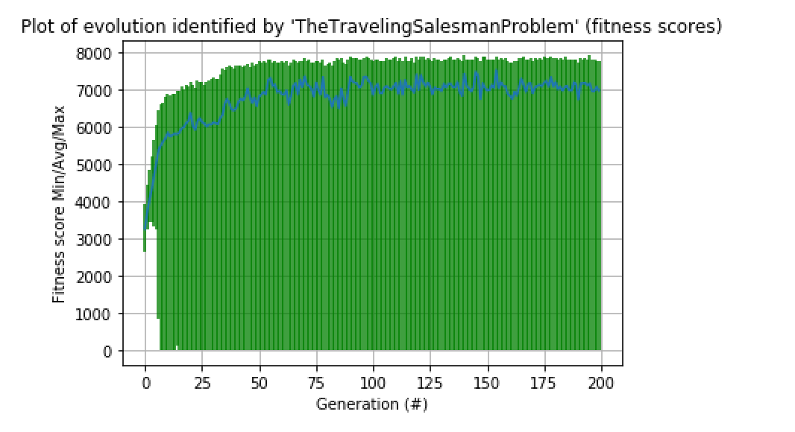
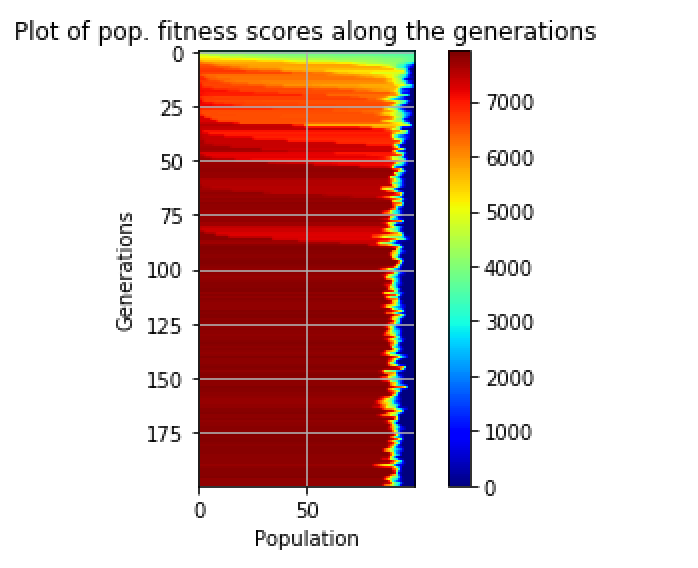

### Fabien Salathe, Paul Ntawuruhunga, Henrik Akesson
### 14.06.2016
### HEIG-VD

# Introduction

In this assignment we will use the power of genetic algorithm to find a solution to a classic problem of computer science, the Traveling Salesman problem.

Genetic algorithms are inspired by the process of natural selection and will help us to fine tune each result and eliminate the worst configurations.


# 6.1 The Traveling Salesman Problem (TSP)

> The travelling salesman problem (TSP) asks the following question: Given a list of cities and the distances between each pair of cities, what is the shortest possible route that visits each city exactly once and returns to the origin city? It is an NP-hard problem in combinatorial optimization, important in operations research and theoretical computer science.
> Wikipedia

The traveling salesman problem asks the following question: "Given a list of cities and the distances between each pair of cities, what is the shortest possible route that visits each city exactly once and returns to the origin city?"


{ width=50% }\

The figure above shows the solution of a TSP: The black line shows the shortest possible path that connects every red dot.


We initialize our genome with the right number of numbers from $0$ to $i$. Each value of the list will represent a $(lat, long)$ of a city.
Our genome is initialized with a random list and each at iteration we calculate the fitness and we re-randomize the genome.
The fitness function represents the travelling between all cities.


## The problem

Given a set of 14 GPS positions where each coordinate represents a city in Burman (Officially the Republic of the Union of Myanmar), the objective is to solve the TSP problem on it.

```python
LAT = [16.47, 16.47, 20.09, 22.39, 25.23, 22.00, 20.47, 
        17.20, 16.30, 14.05, 16.53, 21.52, 19.41, 20.09]

LON = [96.10, 94.44, 92.54, 93.37, 97.24, 96.05, 97.02, 
		96.29, 97.38, 98.12, 97.38, 95.59, 97.13, 94.55]
```

## Our solution

In order to calculate the distance between latitude and longitude pairs we used the Harvarsine formula:


$$d = 2 r \arcsin\left(\sqrt{\operatorname{hav}(\varphi_2 - \varphi_1) + \cos(\varphi_1) \cos(\varphi_2)\operatorname{hav}(\lambda_2-\lambda_1)}\right)$$

$$= 2 r \arcsin\left(\sqrt{\sin^2\left(\frac{\varphi_2 - \varphi_1}{2}\right) + \cos(\varphi_1) \cos(\varphi_2)\sin^2\left(\frac{\lambda_2 - \lambda_1}{2}\right)}\right)$$


# 6.2 Provide the better route you found and the shortest path in kilometers. Is it the optimal shortest path ? explain.

Our implementation gave us the following better route:

`[9, 8, 10, 7, 0, 1, 2, 3, 4, 5, 11, 6, 12, 13]`

The shortest path found is 3354.52km long.

This solution isn't necessarily the best solution to the problem: indeed, our implementation is a **metaheuristic** and thus provides a realistic solution without being exact or optimal. This is due to the fact that the TSP is a NP-complete problem.


# 6.3 Describe your fitness function

As we need to minimize the total distance between points, we first calculate the total distance for a given path then return X - distance. We chose X = 1000, a number big enough to avoid a negative score. With this method, the shorter the path is, the higher the score will be.


# 6.4 Explain the way you encoded the solution, give a chromosome example.

Our chromosome is a list of numbers where each number represents a city. There are 14 cities in total so the range given to the genome is [0:13]

Example:
`[9, 0, 8, 10, 7, 1, 2, 3, 4, 5, 11, 6, 12, 13]`


# 6.5 Provide the configuration of the GA you finally used to find your better results: mutation, crossover, population size, type of selection, mutation, crossover used, number of generations. Describe the methodology or experiments performed in order to get your better results.

 - mutation rate: 0.01
 - population size: 100, we don't need more because it gives the same result but takes more time
 - type of selection: `GTournamentSelector` this selector gave us the best results of all selectors
 - type of crossover used: none, crossover is not useful in our case because we don't want to have an unique list
 - number of generations: 200 more generations does not give a better result after 200. If we had more cities we should have had a higher number


# 6.6 Provide relevant plots of your experiments and explanations.

\

The blue curve seen in the plot above represents the fitness score for each generation. The range varies a lot and is due to the lack of penalty.

\

This heatmap represents the plot of population fitness scores by the number of generations. It remains rather stable across generations with a slight decrease as the number of generations increases.

# 6.7 Conclusions

Through this project we were able to apply the theory viewed during the lectures in a concrete project.
As opposed to the dynamic programming learnt during the Optimisation course, using genetic algorithms proved to be a lot more intuitive and simple.
In conclusion we greatly appreciated solving the TSP with this paradigm.
